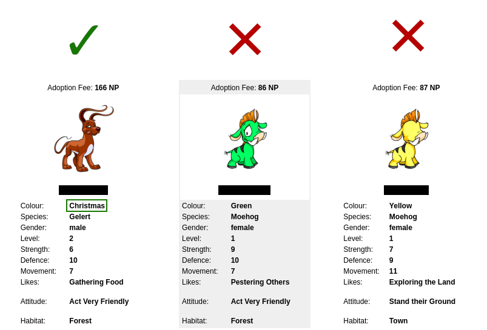

<div id="top"></div>

<div style="text-align: center;">

[![Contributors][contributors-shield]][contributors-url]
[![Forks][forks-shield]][forks-url]
[![Stargazers][stars-shield]][stars-url]
[![Issues][issues-shield]][issues-url]
[![MIT License][license-shield]][license-url]
[![LinkedIn][linkedin-shield]][linkedin-url]

</div>

<!-- PROJECT LOGO -->
<br />
<div align="center">
  <a href="https://github.com/BLovegrove/Neopets-R-Us">
    
  </a>

<h3 align="center">Neopets-R-Us - A Python/Selenium-based Adoption Bot</h3>

  <p align="center">
    My flatmate was feeling nostalgic for Neopets - so I did what any good dev does and created a problem to f- *ahem* fixed a problem they were absolutely already having!
    <br />
    <br />
    (To clarify, Neopets and their parent company are in no way affiliated with this project in any kind of professional capacity - 
    only tangentally as their software is the sandbox my bot plays in)
    <br/>
    <br/>
    <a href="https://github.com/BLovegrove/Neopets-R-Us/issues">Report Bug</a>
    ·
    <a href="https://github.com/BLovegrove/Neopets-R-Us/issues">Request Feature</a>
  </p>
</div>


<!-- TABLE OF CONTENTS -->
<details>
  <summary>Table of Contents</summary>
  <ol>
    <li>
      <a href="#about-the-project">About The Project</a>
      <ul>
        <li><a href="#built-with">Built With</a></li>
      </ul>
    </li>
    <li>
      <a href="#getting-started">Getting Started</a>
      <ul>
        <li><a href="#prerequisites">Prerequisites</a></li>
        <li><a href="#installation">Installation</a></li>
      </ul>
    </li>
    <li><a href="#roadmap">Roadmap</a></li>
    <li><a href="#contributing">Contributing</a></li>
    <li><a href="#license">License</a></li>
    <li><a href="#contact">Contact</a></li>
  </ol>
</details>


<!-- ABOUT THE PROJECT -->
## About The Project

<br />

Earlier joking aside, the issue said flatmate of mine has is a busy schedule that doesnt leave them with the time to sit down and refresh the Neopets pound non-stop looking for rare pet colors. This little program will log in with your credentials using Selenium, load into the pound, and start saving pictures of all the rare 'pets!

It does some fairly simple x-path lookup (fastest method) to check the color field against a blacklist contained in a handy-dandy config file. If the color matches something in the list, ignore it and move on. 

for each pet out of each 3-pet page that fails to match against the blacklist, the bot will take a webpage screenshot and hand it to Pillow for cropping down to just the relevant third of the pets section. That then gets saved as a .png (in wherever you cloned this repo) under the pets unique name! Easy as 3.1415.

<p align="right">(<a href="#top">back to top</a>)</p>


### Built With

* [Selenium](https://www.selenium.dev/)
* [Selenium (python)](https://pypi.org/project/selenium/)
* [TOML](https://pypi.org/project/toml/)
* [Pillow](https://pypi.org/project/Pillow/)


<p align="right">(<a href="#top">back to top</a>)</p>


<!-- GETTING STARTED -->
## Getting Started

To get a local copy up and running follow these simple example steps.

### Prerequisites

* [Python 3.10](https://www.python.org/downloads/release/python-3100/) and [pipenv](https://pipenv.pypa.io/en/latest/)<br/>
  (for linux users, the apt-install for pipenv may be broken! As a general rule, please use python3-pip to install it instead)

* [ChromeDriver](https://chromedriver.chromium.org/downloads) version that matches your [chrome](https://www.google.com/chrome/) installation
<br/>
  - make sure this is in youre $PATH ([Windows](https://jonathansoma.com/lede/foundations-2018/classes/selenium/selenium-windows-install/), [Mac](https://www.swtestacademy.com/install-chrome-driver-on-mac/)) - Linux users can just grab chromium-chromedriver from their preferred package manager.


### Installation

1. Clone the repo
   ```sh
   git clone https://github.com/BLovegrove/Neopets-R-Us.git
   ```
2. Create pipenv with dependencies
   ```sh
   ./Neopets-R-Us/> pipenv install
   ```
3. Rename config_template.toml to config.toml
4. Fill in your Neopets username + password in the config.toml file.
5. Launch the bot with:
   ```sh
   ./Neopets-R-Us/> pipenv run np-bot
   ```
6. Profit!!!

<p align="right">(<a href="#top">back to top</a>)</p>


<!-- ROADMAP -->
## Roadmap

- [x] ~~Scan and save names of rare Neopet colors~~
- [x] ~~Add detailed datetime-based logging system~~
- [x] ~~Save entire pet card with the name~~ 
- [x] ~~Make sure you're auto-creating log + screenshots folder 🤦~~
- [ ] Support multiple accounts if pet slots are full
- [ ] Detect open pet slots and adopt most valuable one(s)
- [ ] Check for ['Un-converted' neopets](https://neopets.fandom.com/wiki/Unconverted) using realtime image processing

See the [open issues](https://github.com/BLovegrove/Neopets-R-Us/issues) for a full list of proposed features (and known issues).

<p align="right">(<a href="#top">back to top</a>)</p>


<!-- CONTRIBUTING -->
## Contributing

Contributions are what make the open source community such an amazing place to learn, inspire, and create. Any contributions you make are **greatly appreciated**.

If you have a suggestion that would make this better, please fork the repo and create a pull request. You can also simply open an issue with the tag "enhancement".
Don't forget to give the project a star! Thanks again!

1. Fork the Project
2. Create your Feature Branch (`git checkout -b feature/AmazingFeature`)
3. Commit your Changes (`git commit -m 'Add some AmazingFeature'`)
4. Push to the Branch (`git push origin feature/AmazingFeature`)
5. Open a Pull Request

<p align="right">(<a href="#top">back to top</a>)</p>


<!-- LICENSE -->
## License

Distributed under the Apache 2.0 License. See `LICENSE.txt` for more information.

<p align="right">(<a href="#top">back to top</a>)</p>


<!-- CONTACT -->
## Contact
Brandon Lovegrove - [@B_A_Lovegrove](https://twitter.com/B_A_Lovegrove) - b.lovegrove.wsd@gmail.com

Project Link: [https://github.com/BLovegrove/Neopets-R-Us](https://github.com/BLovegrove/Neopets-R-Us)

<br />

Like my work?

<a href="https://www.buymeacoffee.com/blovegrove" target="_blank"></a>

<p align="right">(<a href="#top">back to top</a>)</p>


<!-- ACKNOWLEDGMENTS -->
<!-- ## Acknowledgments

* []()
* []()
* []()

<p align="right">(<a href="#top">back to top</a>)</p> -->


<!-- MARKDOWN LINKS & IMAGES -->
<!-- https://www.markdownguide.org/basic-syntax/#reference-style-links -->
[contributors-shield]: https://img.shields.io/github/contributors/BLovegrove/Neopets-R-Us.svg?style=for-the-badge
[contributors-url]: https://github.com/BLovegrove/Neopets-R-Us/graphs/contributors
[forks-shield]: https://img.shields.io/github/forks/BLovegrove/Neopets-R-Us.svg?style=for-the-badge
[forks-url]: https://github.com/BLovegrove/Neopets-R-Us/network/members
[stars-shield]: https://img.shields.io/github/stars/BLovegrove/Neopets-R-Us.svg?style=for-the-badge
[stars-url]: https://github.com/BLovegrove/Neopets-R-Us/stargazers
[issues-shield]: https://img.shields.io/github/issues/BLovegrove/Neopets-R-Us.svg?style=for-the-badge
[issues-url]: https://github.com/BLovegrove/Neopets-R-Us/issues
[license-shield]: https://img.shields.io/github/license/BLovegrove/Neopets-R-Us.svg?style=for-the-badge
[license-url]: https://github.com/BLovegrove/Neopets-R-Us/blob/master/LICENSE.txt
[linkedin-shield]: https://img.shields.io/badge/-LinkedIn-black.svg?style=for-the-badge&logo=linkedin&colorB=555
[linkedin-url]: https://linkedin.com/in/brandon-lovegrove-5ab4181a0
